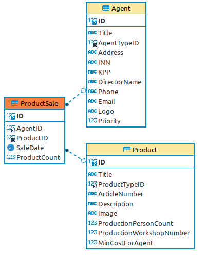
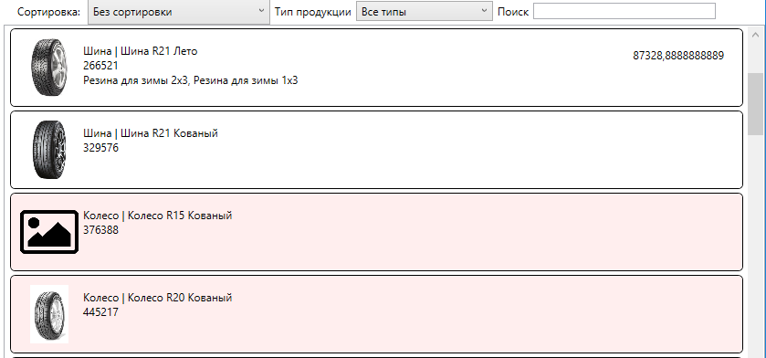

<table style="width: 100%;"><tr><td style="width: 40%;">
<a href="../articles/cs_pagination.md">Пагинация, сортировка, фильтрация, поиск
</a></td><td style="width: 20%;">
<a href="../readme.md">Содержание
</a></td><td style="width: 40%;">
<a href="../articles/cs_min_sum_for_agent.md">Массовая смена цены продукции
</a></td><tr></table>

# Подсветка элементов по условию. Дополнительные выборки.

>В списке продукции необходимо подсвечивать светло-красным цветом те продукты, которые не продавались агентами в последний месяц.

Критерий | Баллы
---------|:---:
Реализовано выделение (любым образом) продуктов, которые не продавались агентами в последний месяц | 1.5
Выделение реализовано в виде светло-красной подсветки элемента продукции | 0.5
**Итого** | **2**

В самом списке продукции данных о продажах нет. Судя по названиям таблиц данные эти должны быть в таблице **ProductSale**. Судя по связям этой таблицы, мы должны заполнить ещё таблицы **Agent** и **AgentType**.



На демо-экзамене до этого вы вряд-ли дойдёте (хотя критерий достаточно жирный), но в рамках курсовой/дипломной работы реализовать дополнительный функционал надо.

## Добавление данных вручную

1. Добавляем типы агентов

    Исходных данных для этой и последующих таблиц нет, поэтому вы можете писать туда что угодно (но близко к предметной области). Для типов агентов подойдут "индивидуальный предприниматель" и "Общество с ограниченной ответственностью" (для не обязательных таблиц много данных придумывать не надо, достаточно одной-двух записей)

    И так как исходных данных нет, а редактировать напрямую из **MySQL Workbench** нельзя, то пишем SQL-запрос вставки данных в основном его синтаксисе (с VALUE)

    ```sql
    INSERT INTO AgentType
        (Title)
    VALUES 
        ('ИП'), ('ООО');
    ```

    Одной командой можно внести сразу несколько строк. Поле *Image* не обязательное, поэтому заполнять я его не стал.

2. Добавляем агента

    ```sql
    INSERT INTO Agent
        (Title, AgentTypeID, INN, Phone, Priority)
    VALUES
        ('ИП Колесников Е.И.', 1, '1234567890', '322223', 0);
    ```

    Тут заполняем только обязательные поля. *AgentTypeID* смотрим в таблице **AgentType**.

3. Создание продаж продукции

    ```sql
    INSERT INTO ProductSale
        (AgentID, ProductID, SaleDate, ProductCount)
    VALUES
        (1, 2, '2021-10-01', 1),
        (1, 3, '2021-10-02', 1),
        (1, 4, '2021-10-03', 1),
        (1, 5, '2021-10-04', 1);
    ```

    Добавляем несколько записей. Поля *AgentID* и *ProductID* смотрим в соответствующих таблицах. Дата продажи заполняется в формате `YYYY-MM-DD`

## Дополнительная выборка

Сначала пишем и отлаживаем запрос получения количества дней с последней продажи (дата продажи сама по себе нам не нужна, достаточно знать сколько дней прошло с момента продажи)

```sql
SELECT 
    ProductID, 
    DATEDIFF(NOW(), max(SaleDate)) AS LastSaleDate
FROM 
    ProductSale
GROUP BY 
    ProductID
```

* Функция **DATEDIFF** вычисляет количество дней между датами. 
* Функция **NOW** возвращает текущую дату.

Теперь этот запрос можно вставить в нашу основную выборку ещё одним **LEFT JOIN**-ом

```sql
SELECT 
    p.*,
    pt.Title AS ProductTypeTitle,
    pp.MaterialList, pp.Total,
    Sales.DaysFromLastSale
--  ^^^^^^^^^^^^^^^^^^^^^^
FROM
    Product p
LEFT JOIN
    ProductType pt ON p.ProductTypeID = pt.ID
LEFT JOIN
    (
    SELECT
        pm.ProductID,
        GROUP_CONCAT(m.Title SEPARATOR ', ') as MaterialList, 
        SUM(pm.Count * m.Cost / m.CountInPack) as Total
    FROM
        Material m,
        ProductMaterial pm
    WHERE m.ID = pm.MaterialID
    GROUP BY ProductID
    ) pp ON pp.ProductID = p.ID
LEFT JOIN 
    (
        select 
            ProductID, 
            DATEDIFF(NOW(), max(SaleDate)) as DaysFromLastSale
        from 
            ProductSale
        group by ProductID
    ) Sales on Sales.ProductID = p.ID ;
```

Атрибут *DaysFromLastSale* в модель пропишите сами.

В методе получения данных с сервера надо вставить проверку на тип **NULL**

```cs
NewProduct.DaysFromLastSale = 
    (Reader["DaysFromLastSale"] as int?) ?? 999;
```

Или просто завернуть чтение этого поля в `try...except` и, при возникновении исключения, подставлять данные по-умолчанию

```cs
try
{
    NewProduct.DaysFromLastSale = Convert.ToInt32(
        Reader["DaysFromLastSale"].ToString());
}
catch (Exception)
{
    // нам не интересно всё, что больше 30
    NewProduct.DaysFromLastSale = 999;
}
```

## Раскраска по условию

Тут элементарно. У элемента рамка (Border) задаем цвет фона:

```cs
<Border 
    BorderThickness="1" 
    BorderBrush="Black" 
    Background="{Binding BackgroundColor}"
                ^^^^^^^^^^^^^^^^^^^^^^^^^
    CornerRadius="5">
```

И добавляем в модель геттер *BackgroundColor*

```cs
public string BackgroundColor {
    get {
        if(DaysFromLastSale>30) return "#fee";
        return "#fff";
    }
}
```

>Про цвета: их можно отдавать в формате **#RGB**. Причём, чем ближе к **F**, тем светлее (**#FFF** - белый)



<table style="width: 100%;"><tr><td style="width: 40%;">
<a href="../articles/cs_pagination.md">Пагинация, сортировка, фильтрация, поиск
</a></td><td style="width: 20%;">
<a href="../readme.md">Содержание
</a></td><td style="width: 40%;">
<a href="../articles/cs_min_sum_for_agent.md">Массовая смена цены продукции
</a></td><tr></table>
