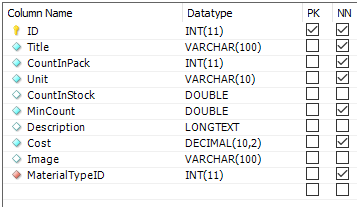

<table style="width: 100%;"><tr><td style="width: 40%;">
<a href="../articles/sql_import.md">Создание базы данных. Импорт данных.
</a></td><td style="width: 20%;">
<a href="../readme.md">Содержание
</a></td><td style="width: 40%;">
<a href="../articles/cs_mysql_connection.md">---
</a></td><tr></table>

# Создание подключения к БД MySQL. Получение данных с сервера.

Дальше мы продолжим разбор задания прошлогоднего демо-экзамена. 

Базу мы развернули и данные в неё импортировали, теперь начнём разбор второй сессии: создание desktop-приложения.

>## Разработка desktop-приложений
>
>### Список продукции
>
>Необходимо реализовать вывод продукции, которая хранится в базе данных, согласно предоставленному макету (файл `product_list_layout.jpg` находится в ресурсах). При отсутствии изображения необходимо вывести картинку-заглушку из ресурсов (picture.png).
>
>
>
>...
>
>Стоимость продукта должна быть рассчитана исходя из используемых материалов.

По макету видно, что на первом экране уже нужны все данные, которые мы импортировали ранее: список продуктов (Product), список материалов (Material) продукта (через таблицу ProductMaterial).

Сразу оговорюсь, что получать данные с сервера можно по-разному: можно через **DataAdapter** загрузить данные в **DataSet** и привязать его к компоненту отображающему данные:

```cs
private DataSet MyDataSet;
...
MySqlDataAdapter mda = new MySqlDataAdapter(
        "SELECT * FROM Product", 
        Connection);

productAdapter.Fill(MyDataSet, "Product");

ProductListView.DataContext = MyDataSet.Tables["Product"].DefaultView;
```

А можно используя **DataReader** заполнять список моделей ~~, что мы и будем дальше делать~~ Мы попробуем реализовать оба варианта.

>В рамках демо-экзамена требуется работать с моделями ("Основные сущности представлены отдельными классами", но стоит это всего 0,2 балла).

## Реализация с помощью моделей и **DataReader**-а.

Шаблон приложения берём из лекций прошлого года.

Первым делом рисуем модели для данных. Если в прошлом году вы их разрабатывали сами, то сейчас придумывать ничего не надо - просто смотрим на структуру таблиц:

### Модель "Продукт"


```cs
public class Product
{
    public int ID { get; set; }
    public string Title { get; set; }
    public int ProductTypeID { get; set; }
    public string ArticleNumber { get; set; }
    public string Description { get; set; }
    public string Image { get; set; }
    public int ProductionPersonCount { get; set; }
    public int ProductionWorkshopNumber { get; set; }
    public decimal MinCostForAgent { get; set; }
}
```

### Модель "Материал"



```cs
public class Material
{
    public int ID { get; set; }
    public string Title { get; set; }
    public int CountInPack { get; set; }
    public string Unit { get; set; }
    public double CountInStock { get; set; }
    public double MinCount { get; set; }
    public string Description { get; set; }
    public decimal Cost { get; set; }
    public string Image { get; set; }
    public int MaterialTypeID { get; set; }
}
```

### Получение данных из базы

1. Создаем интерфейс поставщика данных (пока только для продукции)

    ```cs
    interface IDataProvider
    {
        IEnumerable<Product> GetProducts();
    }
    ```

2. Создаем класс **MySqlDataProvider**, реализующий этот интерфейс

    ```cs
    class MySQLDataProvider: IDataProvider
    {
        // соединение с базой данных
        private MySqlConnection Connection;
    ```

    


    ```cs
        // в конструкторе создаём подключение и сразу его открываем
        public MySQLDataProvider()
        {
            try
            {
                Connection = new MySqlConnection("Server=kolei.ru;Database=ТУТ ВАША БАЗА;port=3306;UserId=ТУТ ВАШ ЛОГИН;password=ТУТ ПАРОЛЬ;");
                Connection.Open();
            }
            catch (Exception)
            {
            }
        }

        // в деструкторе закрываем соединение
        ~MySQLDataProvider()
        {
            Connection.Close();
        }


        // реализуем метод получения списка продукции
        public IEnumerable<Product> GetProducts()
        {
            List<Product> ProductList = new List<Product>();

            // выбираем ВСЕ записи
            // в реальных приложенияъ этого делать, конечно нельзя
            // но у нас базы маленькие, поэтому условиями не заморачиваемся
            MySqlCommand Command = new MySqlCommand(
                "SELECT * FROM Product", 
                Connection);

            // создаем DataReader, который и будет читать данные из базы
            MySqlDataReader Reader = Command.ExecuteReader();

            try
            {
                while(Reader.Read())
                {
                    // для каждой строки таблицы Product создаем экземпляр 
                    // соответствующей модели, заполняем её
                    Product NewProduct = new Product();
                    NewProduct.ID = Reader.GetInt32("ID");
                    NewProduct.Title = Reader.GetString("Title");
                    NewProduct.ProductTypeID = Reader.GetInt32("ID");
                    NewProduct.ArticleNumber = Reader.GetInt32("ID");
                    NewProduct.ProductionPersonCount = Reader.GetInt32("ID");
                    NewProduct.ProductionWorkshopNumber = Reader.GetInt32("ID");
                    NewProduct.MinCostForAgent = Reader.GetInt32("ID");

                    // Методы Get<T> не поддерживают работу с NULL
                    // для полей, в которых может встретиться NULL (а лучше для всех)
                    // используйте следующий синтаксис
                    NewProduct.Description = Reader["Description"].ToString();
                    NewProduct.Image = Reader["Image"].ToString();

                    // и сохраняем в списке
                    ProductList.Add(NewProduct);
                }
            }
            catch (Exception)
            {
            }

            return ProductList;
    }
    ```

3. В конструкторе главного окна создаем поставщика данных и получаем с помощью него список продукции

    ```cs
    public MainWindow()
    {
        InitializeComponent();
        DataContext = this;

        Globals.DataProvider = new MySQLDataProvider();
        var ProductList = Globals.DataProvider.GetProducts();
        ...
    ```

4. В вёрстке главного окна пока выведем обычный **DataGrid**, чтобы проверить, всё-ли нормально

    ```xml
    <DataGrid
        Grid.Row="1"
        Grid.Column="1"
        CanUserAddRows="False"
        AutoGenerateColumns="False"
        ItemsSource="{Binding ProductList}">
        
        <DataGrid.Columns>
            <DataGridTextColumn
                Header="Название"
                Binding="{Binding Title}"/>
            <DataGridTextColumn
                Header="Артикул"
                Binding="{Binding ArticleNumber}"/>
            <DataGridTextColumn
                Header="Описание"
                Binding="{Binding Description}"/>
        </DataGrid.Columns>
    </DataGrid>
    ```

    

## Реализация с помощью **DataAdapter**

Модели в этом варианте рисовать не надо, сразу делаем получение данных

1. Интерфейс поставщика данных

    ```cs
    interface IDataProvider2
    {
        DataView GetProducts();
    }
    ```

2. Класс **MySqlDataProvider2**, реализующий этот интерфейс.

    Конструктор и деструктор не отличаются, а вот получение данных намного проще:

    ```cs
    class MySQLDataProvider2 : IDataProvider2
    {
        private MySqlConnection Connection;
        private DataSet MyDataSet;

        public MySQLDataProvider2()
        {
            try
            {
                Connection = new MySqlConnection("Server=kolei.ru;Database=ТУТ ВАША БАЗА;port=3306;UserId=ТУТ ВАШ ЛОГИН;password=ТУТ ПАРОЛЬ;");
                MyDataSet = new DataSet();
            }
            catch (Exception)
            {
            }
        }

        public DataView GetProducts()
        {
            try
            {
                Connection.Open();
                MySqlDataAdapter productAdapter = new MySqlDataAdapter(
                    "SELECT FROM Product", Connection);
                productAdapter.Fill(MyDataSet, "Product");
                return MyDataSet.Tables["Product"].DefaultView;
            }
            finally
            {
                Connection.Close();
            }
        }
    }
    ```

3. Конструктор главного экрана

    ```cs
    public MainWindow()
    {
        InitializeComponent();
        DataContext = this;

        Globals.DataProvider2 = new MySQLDataProvider2();

        // данные привязываем к контексту визуального компонента
        ProductListGrid.DataContext = Globals.DataProvider2.GetProducts();
    }
    ```

4. Вёрстка практически не отличается, только в *ItemsSource* используем свойство *Table* класса **DataView**

    ```xml
    <DataGrid
        Grid.Row="1"
        Grid.Column="1"
        CanUserAddRows="False"
        AutoGenerateColumns="False"
        Name="ProductListGrid"
        ItemsSource="{Binding Table}">

        <DataGrid.Columns>
            <DataGridTextColumn
                Header="Название"
                Binding="{Binding Title}"/>
            <DataGridTextColumn
                Header="Артикул"
                Binding="{Binding ArticleNumber}"/>
            <DataGridTextColumn
                Header="Описание"
                Binding="{Binding Description}"/>
        </DataGrid.Columns>
    </DataGrid>
    ```

## Получение связанных данных (словари и связи многие-ко-многим)

Нам нужно подсчитать сумму материалов и вывести список этих материалов.


<!-- 

https://docs.microsoft.com/ru-ru/dotnet/api/system.data.dataset?view=net-5.0

https://metanit.com/sharp/adonet/3.7.php

-->