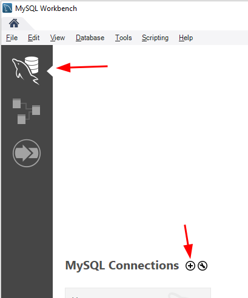
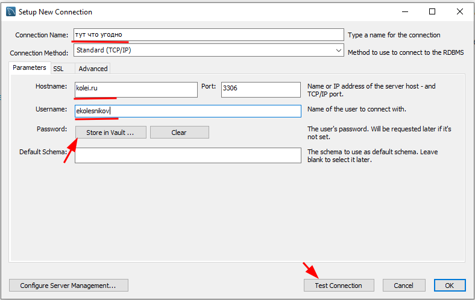
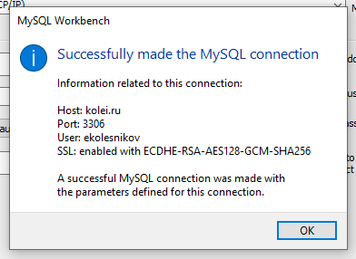
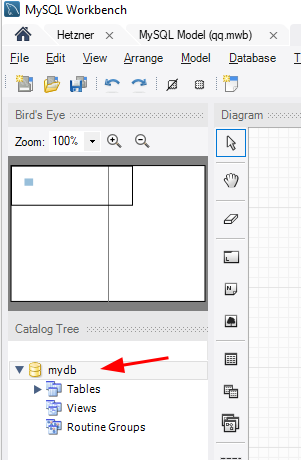
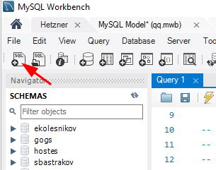
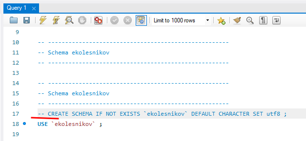
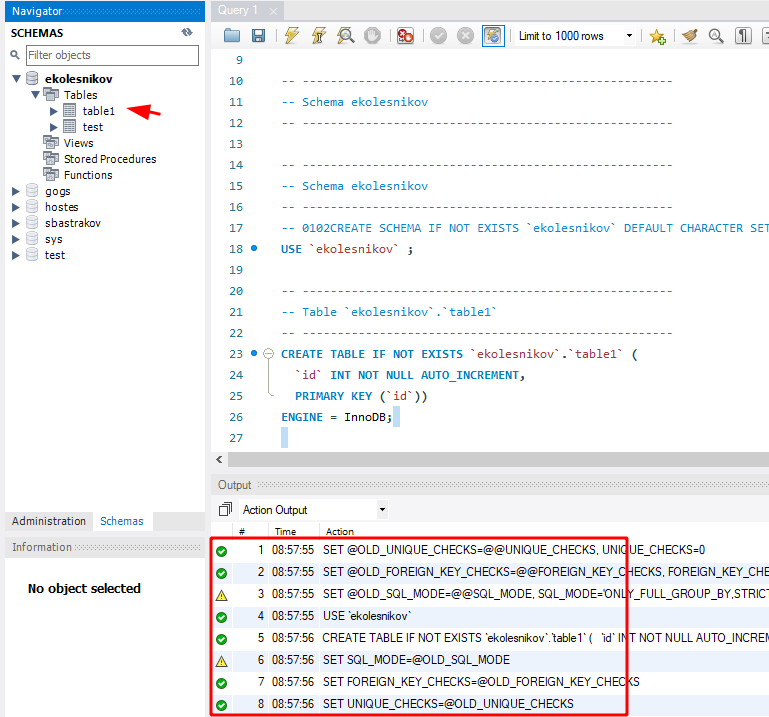

<table style="width: 100%;"><tr><td style="width: 40%;">
<a href="../articles/sql_for_beginner.md">Основы SQL
</a></td><td style="width: 20%;">
<a href="../readme.md">Содержание
</a></td><td style="width: 40%;">
<a href="../articles/wpf_filtering.md">&nbsp;
</a></td><tr></table>

# Создание базы данных. 

## Подключение к базе данных

Прежде чем что-то сделать с базой данных нужно к ней подключиться:

1. Запустите программу *MySQL Workbench*

2. На стартовом окне программы кликните по значку "+"

    

3. В параметрах подключения заполните поля:

    

    * *Connection name* - название подключения. Тут может быть что угодно, но лучше указать свой логин (см. ниже)
    * *Host name* - IP-адрес или доменное имя сервера. В рамках лабораторных работ мы будем работать на удаленном сервере **kolei.ru**, на демо-экзамене будет сервер в локальной сети.
    * *Username* - имя пользователя. Присваивается преподавателем. 
    * *Store in vault* - открывает окно для ввода и СОХРАНЕНИЯ пароля. Дома можете настроить, чтобы каждый раз не вводить пароль, но в классе лучше не использовать.
    * *Test connection* - тест соединения. Программа запросит пароль и попытается подключиться к серверу используя введенные параметры. Если все параметры введены правильно, то появится окно подтверждения.

        

    * В окне настроек соединения жмите "OK"

## Создание БД используя скрипт

1. Окройте EER-диаграмму
2. Переименуйте (правый клик мышкой) базу данных в соответствии со своим *Username* (см. выше)

    

3. Сформируйте скрипт для создания БД: **File** -> **Export** -> **Forward Engineer SQL CREATE Script**. В окнах настроек и объектов пока всё оставляем по-умолчанию. Скопируйте скрипт в буфер обмена.
4. Откройте ранее созданное подключение к БД. Обычно при открытии БД одновременно открывается окно **Query** (запросы). Если его нет, но откройте новое:

    

5. Вставьте в окно запросов скрипт из буфера обмена и закомментируйте строку с созданием схемы (у вас нет прав на создание новых схем)

    

6. Выполните скрипт

    

7. Если всё нормально, то будут созданы все таблицы и связи, которые вы описали в EER

    

>На демо-экзамене в ресурсах будет аналогичный файл скрипта базы данных, но в нём не укзана база данных. Нужно в начале скрипта вписать команду `use <название вашей базы>`

# Импорт данных.

Стандартом *де-факто* для импорта/экспорта данных является формат CSV.

## Что такое CSV-файлы

Формат CSV используют, чтобы хранить таблицы в текстовых файлах. Данные очень часто упаковывают именно в таблицы, поэтому CSV-файлы очень популярны.

CSV расшифровывается как comma-separated values — «значения, разделенные запятыми». Но разделителями столбцов в CSV-файле могут служить и точки с запятой, и знаки табуляции. Это все равно будет CSV-файл.

У CSV куча плюсов перед тем же форматом Excel: текстовые файлы просты как пуговица, открываются быстро, читаются на любом устройстве и в любой среде без дополнительных инструментов.

Из-за своих преимуществ CSV — сверхпопулярный формат обмена данными, хотя ему уже лет 40. CSV используют прикладные промышленные программы, в него выгружают данные из баз.

Одна беда — текстового редактора для работы с CSV мало. Еще ничего, если таблица простая: в первом поле ID одной длины, во втором дата одного формата, а в третьем какой-нибудь адрес. Но когда поля разной длины и их больше трех, начинаются мучения.

Еще хуже с анализом данных — попробуй «Блокнотом» хотя бы сложить все числа в столбце. Я уж не говорю о красивых графиках.

Поэтому CSV-файлы анализируют и редактируют в Excel и аналогах: Open Office, LibreOffice и прочих.

## Как Excel портит данные: из классики

Все бы ничего, но Excel, едва открыв CSV-файл, начинает свои лукавые выкрутасы. Он без спроса меняет данные так, что те приходят в негодность. Причем делает это совершенно незаметно. Из-за этого в свое время мы схватили ворох проблем.

Большинство казусов связано с тем, что программа без спроса преобразует строки с набором цифр в числа.

**Округляет**. Например, в исходной ячейке два телефона хранятся через запятую без пробелов: «5235834,5235835». Что сделает Excel? Лихо превратит номера́ в одно число и округлит до двух цифр после запятой: «5235834,52». Так мы потеряем второй телефон.

**Приводит к экспоненциальной форме**. Excel заботливо преобразует «123456789012345» в число «1,2E+15». Исходное значение потеряем напрочь.

Проблема актуальна для длинных, символов по пятнадцать, цифровых строк. Например, КЛАДР-кодов (это такой государственный идентификатор адресного объекта: го́рода, у́лицы, до́ма).

**Удаляет лидирующие плюсы**. Excel считает, что плюс в начале строки с цифрами — совершенно лишний символ. Мол, и так ясно, что число положительное, коль перед ним не стоит минус. Поэтому лидирующий плюс в номере «+74955235834» будет отброшен за ненадобностью — получится «74955235834». (В реальности номер пострадает еще сильнее, но для наглядности обойдусь плюсом).

Потеря плюса критична, например, если данные пойдут в стороннюю систему, а та при импорте жестко проверяет формат.

**Разбивает по три цифры**. Цифровую строку длиннее трех символов Excel, добрая душа, аккуратно разберет. Например, «8 495 5235834» превратит в «84 955 235 834».

Форматирование важно как минимум для телефонных номеров: пробелы отделяют коды страны и города от остального номера и друг от друга. Excel запросто нарушает правильное членение телефона.

**Удаляет лидирующие нули**. Строку «00523446» Excel превратит в «523446».
А в ИНН, например, первые две цифры — это код региона. Для Республики Алтай он начинается с нуля — «04». Без нуля смысл номера исказится, а проверку формата ИНН вообще не пройдет.

**Меняет даты под локальные настройки**. Excel с удовольствием исправит номер дома «1/2» на «01.фев». Потому что Windows подсказал, что в таком виде вам удобнее считывать даты.

## Побеждаем порчу данных правильным импортом

Если серьезно, в бедах виноват не Excel целиком, а неочевидный способ импорта данных в программу.

По умолчанию Excel применяет к данным в загруженном CSV-файле тип «General» — общий. Из-за него программа распознает цифровые строки как числа. Такой порядок можно победить, используя встроенный инструмент импорта.

**Запускаем** встроенный в Excel механизм импорта.

**Выбирем** CSV-файл с данными, открывается диалог. В диалоге кликем на тип файла Delimited (с разделителями). Кодировка — та, что в файле, обычно определяется автоматом. Если первая строка файла — шапка, отмечем «My Data Has Headers».

**Переходим** ко второму шагу диалога. Выбираем разделитель полей (обычно это запятая). Отключаем «Treat consecutive delimiters as one», а «Text qualifier» выставляем в «{none}». (Text qualifier — это символ начала и конца текста. Если разделитель в CSV — запятая, то text qualifier нужен, чтобы отличать запятые внутри текста от запятых-разделителей.)

На третьем шаге выбираем формат полей, ради него все и затевалось. Для всех столбцов выставляем тип «Text». Кстати, если кликнуть на первую колонку, зажать шифт и кликнуть на последнюю, выделятся сразу все столбцы. Удобно.

Дальше Excel спросит, куда вставлять данные из CSV — можно просто нажать «OK», и данные появятся в открытом листе.

**Но! Если мы планируем экспортировать данные в CSV из Excel, придется сделать еще кое-что.**

После импорта нужно принудительно привести все-все ячейки на листе к формату «Text». Иначе новые поля приобретут все тот же тип «General».

* Нажимаем два раза Ctrl+A, Excel выбирает все ячейки на листе;
* кликаем правой кнопкой мыши;
* выбираем в контекстном меню «Format Cells»;
* в открывшемся диалоге выбираем слева тип данных «Text».

<!-- ## Практическое задание

В каталоге `data` этого репозитория находится структура БД (`ms.sql`) и файлы для импорта: `products_k_import.csv`, `materials_short_k_import.txt`, `productmaterial_k_import.xlsx`.

Необходимо **во-первых**, восстановить структуру БД из скрипта,  **во-вторых**, импортировать исходные данные в **Excel**, **в-третьих** исправить данные (смотрите на структуру таблиц в БД, где-то надо явно указать тип данных, где-то вырезать лишние данные...) и **в-четвёртых** загрузить исправленные данные в БД (сначала просто импорт во временные таблицы, потом разнести SQL-запросами по нужным таблицам) -->