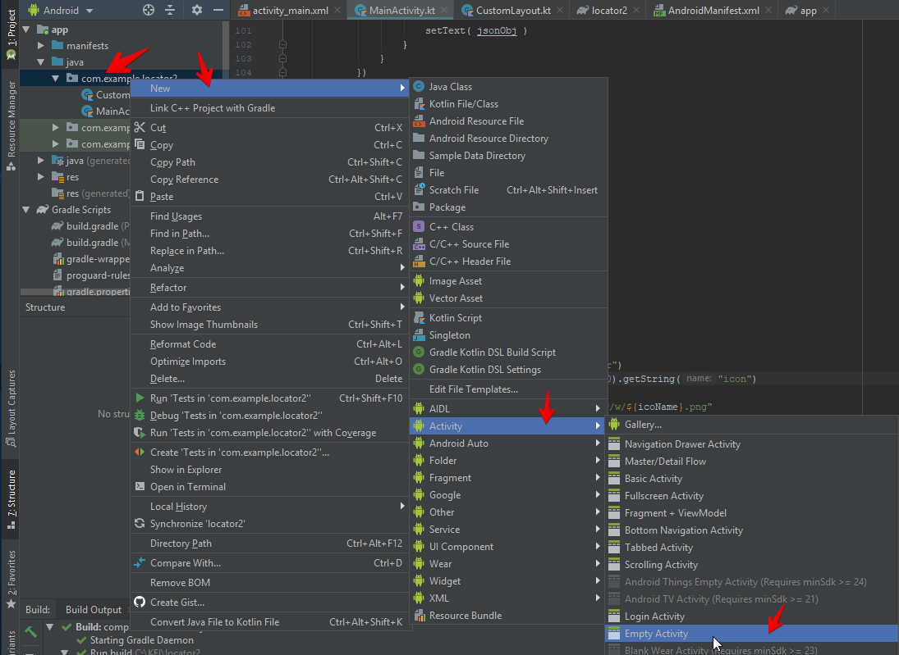
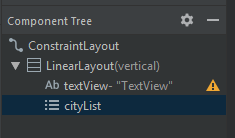
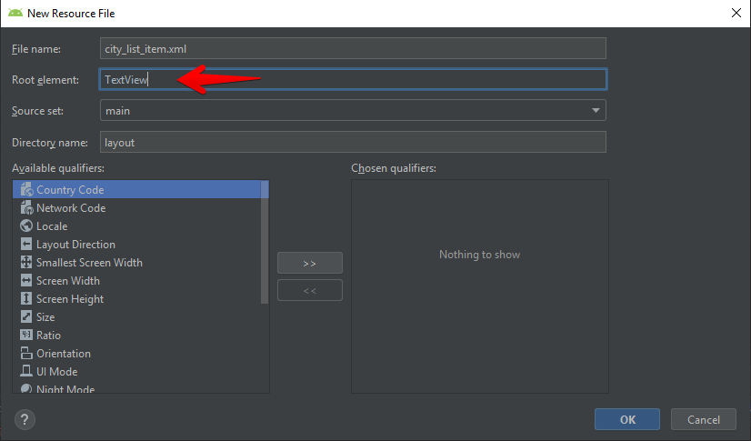
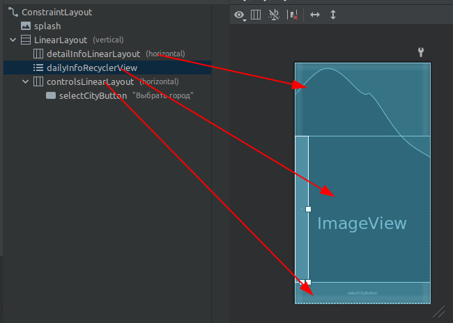

<table style="width: 100%;"><tr><td style="width: 40%;">
<a href="../articles/weather.md">Проект погода (начало): геолокация, http(s)-запросы, разбор json, ImageView.
</a></td><td style="width: 20%;">
<a href="../readme.md">Содержание
</a></td><td style="width: 40%;">
<a href="../articles/weather2.md">Проект погода (продолжение): SplashScreen (заставка). Выбор города. Выбор и отображение массива значений (почасовая, ежедневная)
</a></td><tr></table>

# Проект погода (продолжение): SplashScreen (заставка). Выбор города. Выбор и отображение массива значений (почасовая, ежедневная)

## Содержание

* [SplashScreen](#splashscreen)
* [Выбор города](#выбор-города)
* [Веделение лямбда-выражения в отдельную переменную](#выделение-лямбда-выражения-в-отдельную-переменную)
* [Получение и разбор массива данных. Вывод списка на экран.](#получение-и-разбор-массива-данных-Вывод-списка-на-экран)

## SplashScreen

Если приложение долго грузится (запрос геолокации или "тяжёлых" данных из сети), то принято при запуске показывать заставку (SplashScreen).

Есть два варианта:

1. Рисуют дополнительную **activity** с заставкой и запускают её первой. 
2. Прямо на основной **activity** рисуют **ImageView** поверх всех элементов и скрывают её, когда необходимость в ней исчезает.

Рассмотрим второй вариант (при условии что у нас **ConstraintLayout**):

Я в качестве заставки буду показывать фон:

* первым элементом кладем **ImageView** с картинкой, задав ему режим растягивания на весь экран `android:scaleType="fitXY"` и Z-индекс `android:elevation="999dp"`

    ```xml
    <ImageView
        android:scaleType="fitXY"
        android:elevation="999dp"

        android:id="@+id/splash"
        android:layout_width="match_parent"
        android:layout_height="match_parent"
        app:layout_constraintBottom_toBottomOf="parent"
        app:layout_constraintEnd_toEndOf="parent"
        app:layout_constraintStart_toStartOf="parent"
        app:layout_constraintTop_toTopOf="parent"
        app:srcCompat="@drawable/splash" />
    ```

* в коде главного окна в момент, когда нужно убрать заставку меняем Z-индекс заставки

    ```kt
    val splash = findViewById<ImageView>(R.id.splash)
    splash.elevation = 0F
    ```

    >чтобы картинка нам не мешалась при разработке, мы можем в дизайнере оставить Z-индекс **0**, а в конструкторе окна задать **999F**

Тут надо помнить, что в вёрстке указываются **dp**, а в коде **float**

## Выбор города

>В принципе список можно вывести прямо в главном окне (на форму кинуть **ListView** и с помощью атрибута *elevation* поместить его поверх всех элементов), но в таком случае не будет реализован выход по кнопке *Назад*, что может сказаться на юзабилити. 

Поэтому, будем реализовывать "классический" вариант со списком в отдельном **activity**. Заодно научимся запускать дополнительные **activity** и получать от них ответ.

1. Создаем новую форму (**Activity**) с именем *CityListActivity*

    

2. На главное окно добавляем кнопу перехода на экран выбора города и обработчик для нее:

    ```kt
    startActivityForResult( 
        Intent(this, CityListActivity::class.java), 
        1)
    ```

    Здесь *startActivityForResult* - метод запуска нужной **activity**. 

3. На форму *CityListActivity* кидаем вертикальный **LinearLayout**, в него **TextView** (для заголовка "Выберите город") и **ListView**. **ListView** присваиваем id *cityList*

    


4. В классе *CityListActivity* 

    * создаем массив городов

        ```kt
        private var cityNames = arrayOf(
            "Moscow",
            "Yoshkar-Ola",
            "Kazan"
        )
        ```

    * в конструкторе получаем указатель на **ListView**

        ```kt
        cityListView = findViewById(R.id.cityList)
        ```

    * задаем для списка **ArrayAdapter**. **ArrayAdapter** связывает массив данных с шаблоном элемента списка.

        ```kt
        cityListView.adapter = ArrayAdapter(
            this,
            R.layout.city_list_item,
            cityNames
        )
        ```

        Android Studio покажет ошибку, что не знает что такое ``city_list_item`` - в контекстном меню добавляем реализацию:

        

        **Внимание!** RootElement поменять на TextView

        

        Созданный шаблон можно настроить (установить высоту, добавить границы...)

    * задаем обработчик клика по элементу списка

        ```kt
        cityListView.setOnItemClickListener { parent, view, position, id ->
            // получаем название города
            val cityName = cityNames[position]

            // запоминаем выбранное название города в параметрах
            val newIntent = Intent()
            newIntent.putExtra("cityName", cityName)
            setResult(RESULT_OK, newIntent)

            // заверщаем текущий activity
            finish();
        }
        ```

5. В классе главного окна для получения результата выбора реализуем метод *onActivityResult*

    ```kt
    @SuppressLint("MissingSuperCall")
    override fun onActivityResult(requestCode: Int, resultCode: Int, data: Intent?) {
        if (data == null) {
            return
        }
        val name = data.getStringExtra("cityName")

        // тут запускаем http-запрос по имени города
    }
    ```

    >Метод *onActivityResult* гугл объявил устаревшим (deprecated), и в IDE он помечается как ошибка - надо в контекстном меню "More action..." выбрать "Supress: add...". Перед методом будет добавлена аннотация `@SuppressLint("MissingSuperCall")`.

## Выделение лямбда-выражения в отдельную переменную

Для обработки результатов мы пользовались такой конструкцией - лямбда выражение передавали сразу в метод *requestGET*. 

```kt
HTTP.requestGET(url) {result, error ->
    if(result != null) {
        val json = JSONObject(result)
        val wheather = json.getJSONArray("weather")
        val icoName = wheather.getJSONObject(0).getString("icon")
        val temp = json.getJSONObject("main").getDouble("temp")

        runOnUiThread {
            textView.text = json.getString("name")
        }
        ...
    }
}
```

Но теперь тот же код будет использоваться для получения погоды по городу. Поэтому имеет смысл вынести код в отдельную переменную и использовать её в обоих вызовах:

```kt
// callback - свойство класса, объявляется в теле класса
private val callback: (result: String?, error: String) -> Unit = {result, error ->
    if(result != null) {
        val json = JSONObject(result)
        val wheather = json.getJSONArray("weather")
        val icoName = wheather.getJSONObject(0).getString("icon")
        val temp = json.getJSONObject("main").getDouble("temp")

        runOnUiThread {
            textView.text = json.getString("name")
        }
        ...
    }
}

...

// при запросе погоды используем переменную, объявленную выше
HTTP.requestGET(url, callback) 
```

## Получение и разбор массива данных. Вывод списка на экран.

Для начала определимся со структурой формы:

Всё окно разбито по вертикали на три блока (указаны стрелками на рисунке ниже)

* первый блок - детальная информация о выбранной погоде
* второй блок - горизонтальный список кратких данных о погоде
* третий блок - панель с кнопками (пока у нас там только "Поиск города", но может ещё что-то придумаем)



### Класс погода

Для хранения массива полученных данных нам нужно описать структуру элемента списка. Для этого в котлине есть **data class** - класс, который содержит только свойства.

Выглядит он примерно так (каждый класс жедательно заворачивать в отдельный файл)

```kt
data class Weather (
    val dt: Int,
    val mainTemp: Double,
    val mainHumidity: Int,
    val weatherIcon: String,
    val weatherDescription: String,
    val windSpeed: Double,
    val windDeg: Int,
    val dtTxt: String
    )
```

### Заполнение массива данных о погоде

С моим бесплатным аккаунтом на **openweathermap** кроме текущих данных можно запросить только список за 5 дней:

```
### Запрос погоды за 5 дней https://openweathermap.org/forecast5
GET https://api.openweathermap.org/data/2.5/forecast?lat={{lat}}&lon={{lon}}&appid={{token}}&lang=ru&units=metric
```

1. Объявим в классе главного окна массив данных о погоде

    ```kt
    private val weatherList = ArrayList<Weather>()
    ```

2. Получаем и заполняем массив 

    ```kt
    val url = "https://api.openweathermap.org/data/2.5/forecast?lat=${lat}&lon=${lon}&appid=${token}&lang=ru&units=metric"
    HTTP.requestGET(url) {result, error ->
        if(result != null) {
            // перед заполнением очищаем список
            weatherList.clear()

            val json = JSONObject(result)
            val list = json.getJSONArray("list")

            // перебираем json массив
            for(i in 0 until list.length()){
                val item = list.getJSONObject(i)
                val weather = item.getJSONArray("weather").getJSONObject(0)

                // добавляем в список новый элемент
                weatherList.add(
                    Weather(
                        item.getInt("dt"),
                        item.getJSONObject("main").getDouble("temp"),
                        item.getJSONObject("main").getInt("humidity"),
                        weather.getString("icon"),
                        weather.getString("description"),
                        item.getJSONObject("wind").getDouble("speed"),
                        item.getJSONObject("wind").getInt("deg"),
                        item.getString("dt_txt")
                    )
                )
            }

            runOnUiThread {
                // уведомляем визуальный элемент, что данные изменились
                dailyInfoRecyclerView.adapter?.notifyDataSetChanged()
            }
        }
        else
            Log.d("KEILOG", error)
    }
    ```

### Вывод списка (RecyclerView)

**RecyclerView** - рекомендованный способ вывода списков (с его помощью можно было теоретически заполнить и список городов, но он для этого слишком монструозный). Его особенность в том, что визуальные элементы списка существуют только при отображении на экране. При выходе за экран визуальный элемент удаляется, перед появлением создается заново. Таким образом экономится память.

Итак, на форме у нас уже лежит элемент **RecyclerView** (№2)

В класс главного окна добавим переменную для связи с элементом **RecyclerView**

```kt
private lateinit var dailyInfoRecyclerView: RecyclerView
```

Затем в конструкторе её инициализируем и назначаем *layoutManager* и *adapter*

```kt
dailyInfoRecyclerView = findViewById(R.id.dailyInfoRecyclerView)

// назначаем менеджер разметки
dailyInfoRecyclerView.layoutManager = LinearLayoutManager(this, RecyclerView.HORIZONTAL, false)

// создаем адаптер
val weatherAdapter = WeatherAdapter(weatherList, onIconLoad)

// при клике на элемент списка показать подробную информацию (сделайте сами)
weatherAdapter.setItemClickListener {
    Log.d("KEILOG", "Click on ${it.weatherIcon}")
}

dailyInfoRecyclerView.adapter = weatherAdapter
```

Класс **WeatherAdapter** мы должны написать сами. Я положил его в [шпаргалки](../shpora/WeatherAdapter.kt).

Разметка для элемента списка (не полная)

```xml
<?xml version="1.0" encoding="utf-8"?>
<LinearLayout
    android:id="@+id/container"
    xmlns:android="http://schemas.android.com/apk/res/android"
    android:orientation="vertical"
    android:layout_width="100dp"
    android:layout_height="match_parent">

    <ImageView
        android:id="@+id/weather_icon"
        android:layout_width="match_parent"
        android:layout_height="100dp"/>

    <TextView
        android:layout_width="match_parent"
        android:layout_height="wrap_content"
        android:text="Температура"
        />
    <TextView
        android:id="@+id/weather_temp"
        android:layout_width="match_parent"
        android:layout_height="wrap_content"/>

</LinearLayout>
```

### Перфекционизм

Информация в **RecyclerView** может затеряться на ярком фоне. Чтобы этого не происходило можно либо задать для **RecyclerView** фон с заливкой каким-то цветом, либо, что-бы не полностью скрывать наш красивый фон, сделать этот фон полупрозрачным. 

Для задания полупрозрачности элемента используется тег **alpha**, но с ним тоже не всё хорошо - полупрозрачным становится и всё содержимое элемента.

Есть другой вариант: задать в качестве фона **drawable** ресурс, которому заливку указать с альфа-каналом:

```xml
<?xml version="1.0" encoding="utf-8"?>
<shape
    xmlns:android="http://schemas.android.com/apk/res/android">
    <solid
        android:color="#80FFFFFF"/>
</shape>
```

# Задание

* вывести в элементы списка остальную информацию о погоде
* при обновлени списка и при клике на элемент списка выводить в верхнюю часть детальную информацию о погоде


# Это интересно

https://habr.com/ru/company/true_engineering/blog/267497/
